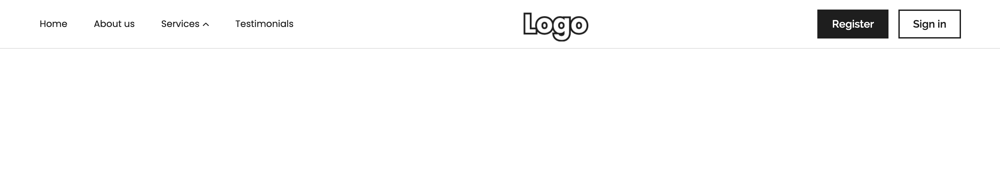
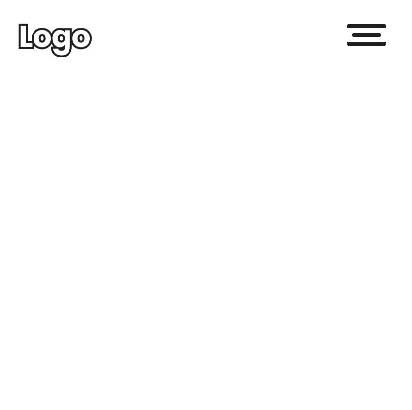
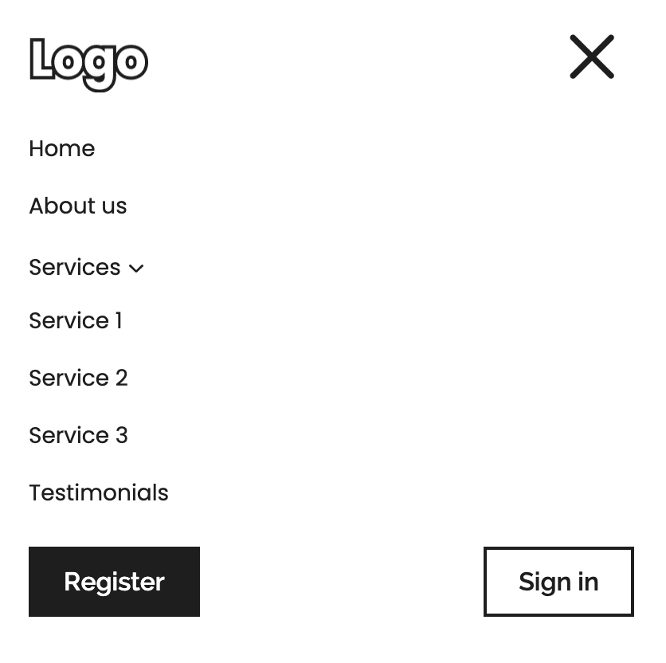

# Responsive Header & Mobile Menu

A small project showcasing a fully responsive header with desktop navigation, mobile menu, and animations — styled with **Styled-Components** and SVG icons via **SVGR**.

## Technologies used
* HTML5
* Styled Components
* React
* TypeScript
* Vite
* Git

## Instructions for Working with the Project

	1. Open your terminal and run the following command to clone the repository:
    
        git clone https://github.com/modeltoIT/responsive-header.git
    
    2. Move into the project directory:

        cd responsive-header
    
    3. Ensure that Node.js version v20.x.x is installed. Verify this by running:
    
        node -v
    
        If the version is incorrect, install or update Node.js from Node.js official website.
        
    4. Install the necessary project dependencies by running:
    
        npm install

    5. Start the development server with the command:

        npm run dev

## View Project

Live Demo: [View the Project](https://modeltoit.github.io/responsive-header/)

## Preview

